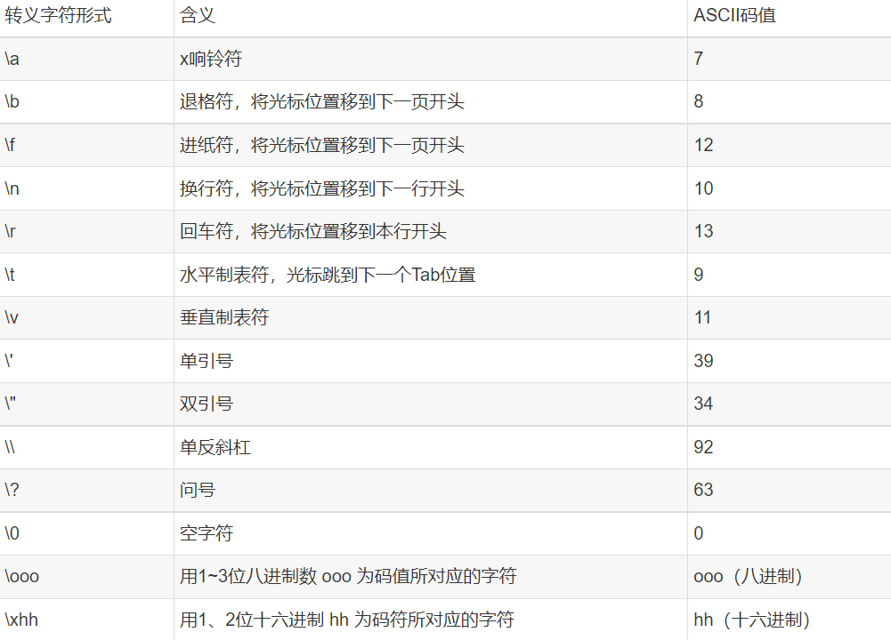
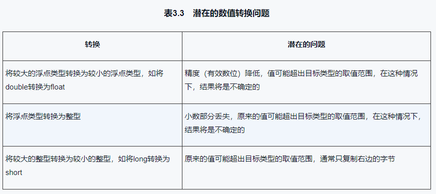
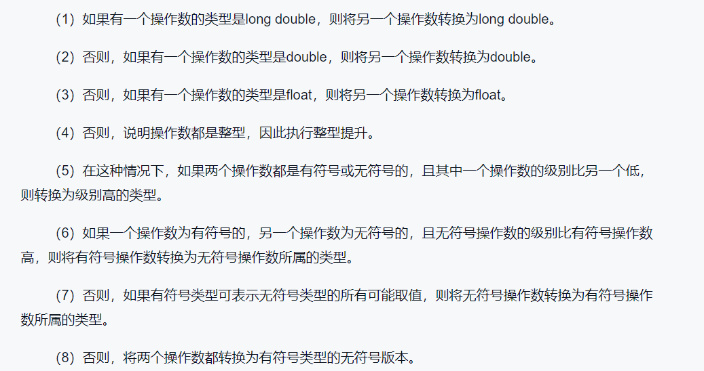
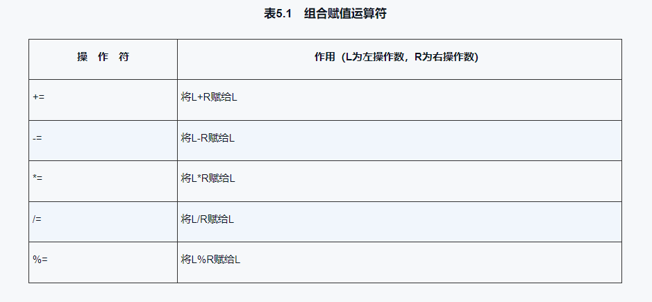
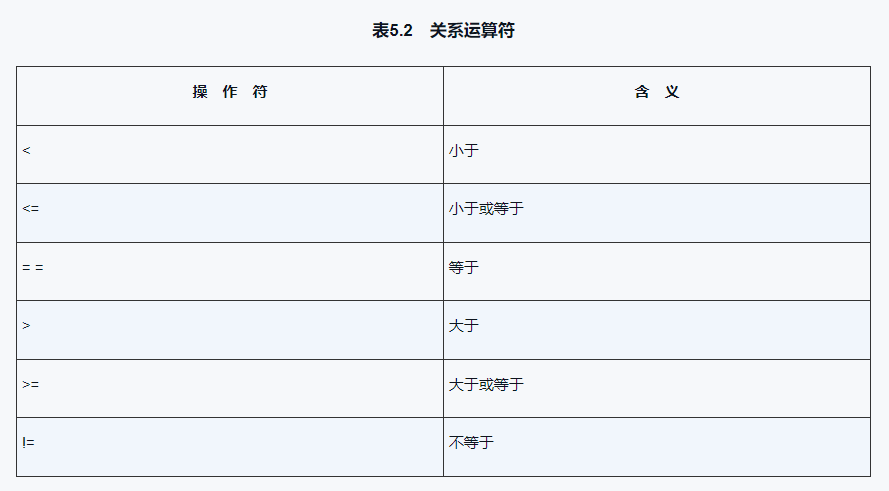
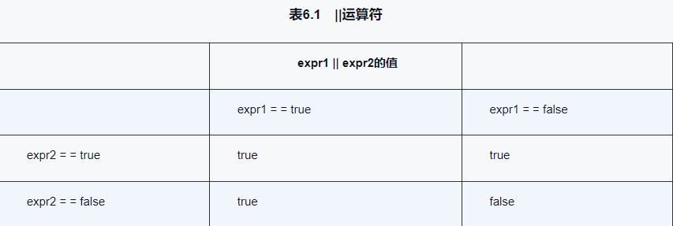
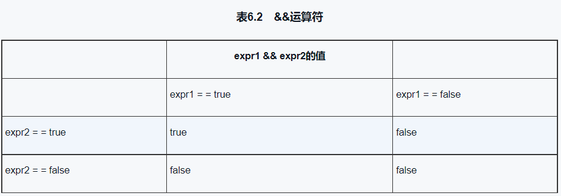
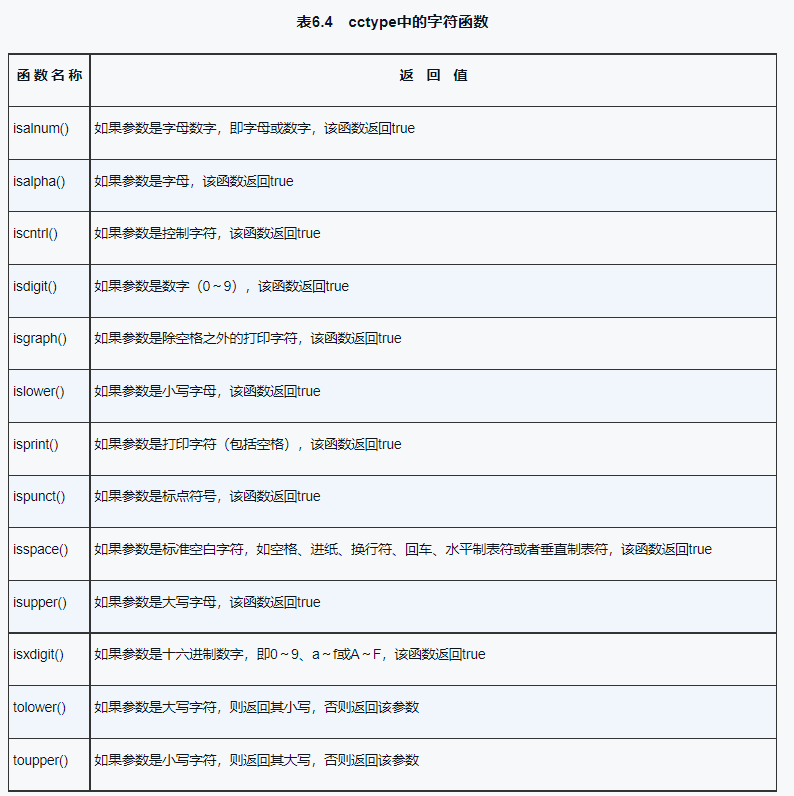
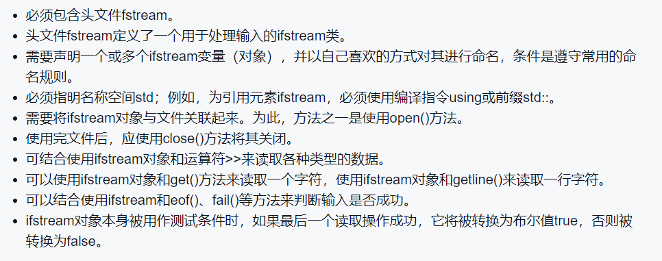
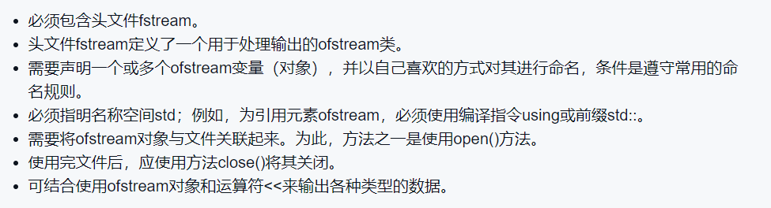

# C++ Primer Plus

## 第2章 进入C++
   1. 在C语言中，省略返回类型相当于说函数的的类型为`int`，然而，C++逐步淘汰了这种用法
   2. 使用`cin`、`cout`进行输入输出的程序必须包含文件`iostream`
   3. `using namespace std;`使得`std`名称空间中的所有名称都可用，而不必使用`std::`前缀 
      若只使所需的名称可用，则可使用`using std::xxxx`
   4. 类描述了一种数据类型的全部属性，对象则是根据这些描述创建的一个实例
   5. `函数原型`--只描述函数接口，描述的时发给函数的信息和返回的信息 
      `函数定义`--包含函数的所有信息，包括函数原型和函数体
   - C++程序的模块叫`函数`
   - `#include <iostream>`预编译指令会导致处理器将`iostream`文件中的内容添加到程序中

## 第3章 处理数据
   1. C++命名规则： 
      - 在名称中只能使用字母字符、数字和下划线(_)
      - 名称的第一个字符不能是数字
      - 区分大小写字母
      - 不能将C++关键字用作名称
      - 以两个下划线打头或以下划线和大写字母打头的名称被保留给实 现(编译器及其使用的资源)

     使用。以一个下划线开头的名称被保留给实现，用作全局标识符
      - C++用于名称的长度没有限制，名称中所有的字符都有意义，但有些平台有长度限制
   2. 整型`short、int、long`和`long long`
      - `short`至少16位
      - `int`至少和`short`一样长
      - `long`至少32位，且至少和`int`一样长
      - `long long `至少64位，且至少和`long`一样长
      - “字节”的含义依赖于实现，因此在一个系统中，两字节的`int`可能是16位，也可能是32位
      - `INT_MAX`和`INT_MIN`是整型的最大值和最小值
      - `SHRT_MAX`和`SHRT_MIN`是短整型的最大值和最小值
      - `LONG_MAX` 和`LONG_MIN`是长整型的最大值和最小值
      - `LLONG_MAX`和`LLONG_MIN`是长长整型的最大值和最小值
      - `CHAR_BIT`是一个整数，它表示一个字节有多少位
   3. C++初始化方式
      - 初始化一个变量的值，可以使用`=`或`= {} `(也可以身份略等号`=`)
      - 当大括号内不包含任何东西时，变量将被初始化为0
   4. 无符号类型
      - `unsigned`本身是`unsigned int`的缩写
   5. 整型字面值
      -  诸如`cout << hex`等代码不会在屏幕上显示任何内容，而只会修改该`cout`显示整数的 
      方式   
   6. `char`类型：字符和小整数
      
      - `unsigned char `: -128 -- 127
      - `signed char `: 0 -- 255
   7. `wchat_t`类型：可以表示扩展字符集，是一种整数类型，可以表示系统使用的最大扩展字符集
      - `wcin`和`wcout`
   8. `char16_t`：无符号的16位整数，使用前缀`u`
      `char32_t`: 无符号的32位整数，使用前缀`U`  
   9. `bool`类型：只有两个值，`true`和`false`
      - `true`：非零值
      - `false`：零
   10. `const`限定符

     - 常量被初始化后，编译器将不允许再次修改该常量的值
     - 常见做法是将常量名称的首字母大写
     - 如果在声明常量时没有提供值，则该常量的值将是不确定的
   11. 浮点数
       - 标准小数点表示法、E表示法
       - `float`类型：至少32位，最多64位
       - `double`类型：至少64位，最多128位
       - `long double`类型：至少128位，最多256位
       - 通常`cout`会删除小数点结尾的0，调用`cout.self()`可以覆盖这种行为
       - 默认情况下，浮点常量都属于`double`类型，如果希望常量为`float`类型，则需要使用 
       `f`或`F`后缀；对于`long double`类型可以使用`l`或`L`后缀
       - 浮点运算的速度通常比整数运算慢，且精度将降低
       - 对于`float`，C++只保证6位有效位
   12. 数值转换
       
       - 在C++中，使用大括号的初始化被称为列表初始化。列表初始化不允许缩窄。
       - 当运算涉及到两种类型时，较小的类型将被转换为较大的类型。 
       
       - 强制转换格式:
           1. `(类型) 变量`
           2. `类型 (变量)`
           3. `ststic_cast<类型> (变量)`
       - `auto`关键字
       - 在C++中，`auto`关键字可以自动推断变量的类型，但是不能自动推断数组的大小

## 第4章 复合类型
  1. 数组：可以存储多个同类型的值
     - 通用格式： `typeName arrayName[arraySize];`
     - `arraySize` 可以是常量表达式，也可以是变量表达式
     - 如果数组大小是常量表达式，则数组大小不能改变
  2. `sizeof()`运算符返回类型或数据对象的长度（单位为字节）
  3. 数组的初始化规则：
     - 只有在定义数组时才能使用初始化，此后就不能使用，也不能将一个数组赋值给另一个数组
     - 初始化数组时，提供的值可以少于数组的元素数目，编译器会将其他元素设置为默认值
     - 如果初始化时方括号`[]`内为空，C++编译器将会计算元素个数(糟透了)
   4. C++11 数组初始化方法：
      - 初始化数组时，，可以省略`=`
      - 可不在大括号`{}`内包含任何东西，这会把所有元素设置为0
      - 列表初始化禁止缩窄转换
   5. C风格字符串：以空字符结尾`\0`
      - 在确定存储字符串所需的最短数组时，别忘了将结尾的空字符计算在内
      - 字符串常量(使用双引号)不能与字符常量(使用单引号)互换
   6. `strlen()`返回字符串的长度，而不是数组本身的长度，且只计算可见的字符，不包含空字符
   7. 字符串输入:
      - `cin`使用空白(空格、制表符、换行符)作为分隔符
      - 面向行的输入:  
       `getline()`：`cin.getline(strName,size)`,以换行符为结尾，但不保存换行符，存储时用空字符替换换行符
        `get()`(保留换行符): `cin.get(strName,size)`
        可采用拼接方式
      - 当`getline()`和`get()`读取空行时，会设置失效位(failbit),接下来的输入将被阻断，可用`cin.clear()`恢复输入
   8. `string`类：头文件`string`
      - 可以使用C风格字符串来初始化`string`对象
      - 可以使用`cin`来将键盘输入存储到`string`对象中
      - 可以使用`cout`来输出`string`对象
      - 可以使用数组表示法来访问存储在`string`对象中的字符
      - 类设计可以让程序自动处理`string`的大小，并且可以自动扩容
      - C++11 允许将列表初始化用于`string`对象
      - 可以将一个`string`对象赋值给另一个`string`对象
      - 可以使用`+`将两个`string`对象连接起来
      - 可以使用`+=` 将一个`string`对象追加到另一个`string`对象
      - `strcpy(a,b)`将字符串b复制到字符串a
      - `strcat(a,b)`将字符串b追加到字符串a
      - `getline(cin, str)`将一行输入存储到`string`对象中
      - 原始字符串：字符表示的就是自己，即`\n`为输出`\`和`n`，使用`"(`、`)"`定界符，并使用前缀`R`来标识原始字符串。原始字符串语法允许在表示字符串开头的`"`和`(`之间添加其他字符，这意味着表示字符串结尾的`")`和`)`之间也必须包含这些字符,但空格、左右括号、斜杠、控制字符除外。`eg: R"+*(  XXX )+*"`
   9. 结构：关键字`struct`
      - C++允许在声明结构变量时省略关键字`struct` 
      - 可以使用成员运算符`.`来访问各个成员
      - 结构外部声明可以被后面的任何函数使用；内部声明只能被该声明所属的函数使用
      - 结构初始化：由逗号分隔值列表，并将这些值用花括号括起(等号可忽略)；如果大括号内未包含任何东西，各个成员都将被赋值为0.不允许缩窄转换。
      - 将变量名放在结束括号的后面，可以同时完成定义和声明。
   10. 位字段：指定占用特定位数，字段的类型为整型或枚举 `eg: int SN : 4;`
   11. 共用体：能够存储不同的数据类型，但只能同时存储其中的一种类型.关键字`union`
       - 共用体长度为其最大成员的长度
       - 共用体每次只能存储一个值
       - 共用体常用于(并非只能用于)节省内存
   12. 枚举
       - 在默认情况下，将整数值赋给枚举量，第一个枚举量的值为0
       - 在不进行强制类型转换的情况下，只能将定义枚举时使用的枚举量赋值给这种枚举的变量
       - 对于枚举变量，只定义了赋值运算符，没有为枚举定义算术运算 
         `eg: name++; //非法`
       - 枚举量是整型，可被提升为整型，但`int`类型不能自动转换为枚举类型
       - 如果`int`值是有效的，则可以通过强制类型转换，将它赋值给枚举变量`eg band = spectrum(3);`
       - 可以用赋值运算符来显式地设置枚举量的值 
         `eg: enum bits(one = 1, two = 2);`
         也可以只显式设置其中一些枚举量的值，后面未初始化的枚举量的值将比其前面的枚举量的值大1
       - 可以创建多个值相同的枚举量
       - 枚举定义的取值范围： 
         上限：大于枚举量最大值的、最小的2的幂-1 `eg: 101---->128-1`
         下限：小于枚举量最小值的、最大的2的幂+1 `eg: -6----->-8+1`r
   13. 指针和自由存储空间
       - 指针是一个变量，其存储的是值的地址，而不是值本身
       - 获取常规变量地址：对变量应用地址运算符`&`     
       - 使用常规变量时，值是指定的量，而地址为派生量
       - 处理存储数据时，将地址视为指定的量，而值视为派生量
       - 特殊类型变量--`指针`:指针变量用于存储值的地址  
         指针名表示的是地址，*指针名表示的是值(`*`--间接值/解除引用运算符)
       - 指针变量声明：`int *p;`、 `int* p;`、 `int * p;
       - 在声明语句中初始指针，被初始化的是指针，而不是它指向的值
       - 一定要在对指针应用`*`之前，将指针初始化为一个**确定的、适当的**地址
       - 指针不是整型，因此不能简单地将整数赋值给指针变量  
         要将数字值作为地址赋给指针变量，必须先将其转换为指针`(int*) value`
       - 为一个数据对象(可以是结构，也可以是基本类型)获得并指定分配内存的通用格式如下： 
         `typeName * pointer_name = new typeName;`
       - 在C++中，值为0的指针变量是一个空指针，而不是一个NULL指针
       - 使用`delete`释放使用`new`分配的内存，但不会删除指针本身 
         不能用`delete`释放声明变量所获得的内存
         不能使用`delete`释放同一个内存块两次
         对空指针应用`delete`是安全的
         如果使用`new []`分配的内存，则必须使用`delete []`释放
         使用`delete`的关键在于，将它用于`new`分配的内存。这并不意味着要使用用 
         于`new`的指针，而是用于`new`的地址。
       - `静态联编`：在编译时给数组分配内存，须在编写时指定数组长度
         `动态联编`：在运行时给数组分配内存，使用`new`分配内存，在运行时确定数组长度 
                     `int * psome = new int[10];  delete [] psome;`
       - 不能用`sizeof`运算符来确定动态分配的数组包含的字节数
       - 访问动态数组的元素，只需把指针当作数组名即可`eg Pointer_name[index]`
       - `point_name ++;`和`point_name --;`是指针变量的前后移动操作
   14. 指针、数组和指针算术
       - 将指针变量加1后，其增加的值等于指向的类型占用的字节数 
         `arrayname[i]  -----  *(arrayname + i)`
         `pointername[i]  -----  *(pointername + i)`
       - 对指针应用`sizeof`得到的是指针的长度
       - 数组名被解释为其第一个元素的地址，而对数组名应用地址运算符时，得到的是整个数组的地址
       - 如果给`cout`提供一个字符的地址，则它将会从该字符开始打印，直到遇到空字符为止
       - 在C++中，char数组名、char指针以及用引号括起的字符串常量都被解释为字符串第一个字符的地址
       - 在将字符串读入程序时，应使用已分配的内存地址。该地址可以是数组名，也可以是使用`new`分配的指针
       - 经常使用将字符串放到数组中：初始化数组时，请使用`=`运算符；否则应使用`strcpy()`、`strncpy()`  
         `strncpy(arrayname, stringname, sizeof(arrayname));`
       - 使用`new`创建动态结构：
         `struct_name * pointer_name = new struct_name;`
         `delete pointer_name;`
         可使用`->`箭头成员运算符来访问结构的成员
       - 根据用于分配内存的方法，C++有三种管理数据内存的方式：
         - 动态内存：通过`new`分配的内存，在程序结束时自动/`delete`释放
         - 自动存储：在函数内部定义的常规变量使用自动存储空间，称为自动变量。在函数调用时自动产生，在函数结束时自动释放。  
         - 静态存储：整个程序执行期间都存在的存储方式。一是在函数外面定义，二是在声明变量时使用关键字`static`
       - 使用`new`在自由存储空间创建变量后，如果没有调用`delete`，则即使包含指针的内存由于作用域规则和对象生命周期 
         的原因而被释放，在自由存储空间上动态分配的变量或结构也将继续存在。实际上，将会无法访问自由存储空间中的结构，因为 
         指向这些内存的指针已经不存在了。这将导致内存泄漏。被泄漏的内存将在程序的整个生命周期内都不可使用;这些内存被分配 
         出去，但无法收回。极端情况（不过不常见)是，内存泄漏可能会非常严重，以致于应用程序可用的内存被耗尽，出现内存耗尽 
         错误，导致程序崩溃。  

   15. 数组的替代品
       - 模板类`vector`:动态数组，可以指定元素类型，可以指定元素个数，可以指定元素的初始值
         - 指定头文件`<vector>`
         - 声明：`vector<type> name(n_elem);`
       - 模板类array(C++11): 长度固定
         - 指定头文件`<array>`
         - 声明： `array<type, n_elem> name;` 其中，`n_elem`是数组的长度，不能是变量
       - 在C++11中，可将列表初始化应用于`vector`和`array`
         - 声明：`vector<type> name = {value1, value2, ..., valueN};`
         - 声明：`array<type, n_elem> name = {value1, value2, ..., valueN};`
       - 无论是数组、`array`还是`vector`，都可以使用`[]`运算符来访问元素
       - 数组和`array`对象存储在相同的内存区域(即栈)中，`vector`对象存储在堆/自由存储区中
       - 可以将一个`array`对象赋值给另一个`array`对象，而数组必须逐个复制数据
       - `vector`和`array`的成员函数`at()`，将在运行期间捕获非法索引，程序默认中断
         `eg: a.at(1) = 2;`

## 第5章 循环和关系表达式
  1. for循环：`for (init; condition; update-expression)`
     - 初始化：`init`，可以是变量的赋值，也可以是空语句，可声明变量(当离开循环后，这种变量将消失)
     - 条件：`condition`，可以是布尔表达式，也可以是函数调用，也可以是空语句
     - 更新表达式：`update-expression`，在每轮循环结束时执行,可以啊是任何有效的表达式
     - 循环只执行一次初始化
     - C++常用的方式是。在`for`和括号之间加上一个空格，而省略2函数名与括号之间的空格
     - 赋值运算符是从右向左结合的
     - 对任何表达式加上分号都可以成为语句。但这句话反过来说就不对了。就我们目前所使用的语句而言，返回语句、声明语句和`for`语句都不满足 
       `语句 = 表达式 + 分号`这种模式
     - `cout`在显示`bool`值之前将它们转换为`int`值，但`cout.setf(ios::boolalpha)`可以改变这种转换的方式,显示`true`和`false`
     - 递增运算符(`++`)、递减运算符(`--`)  
       `++a`是先将`a`的值加1，然后使用新的值计算表达式；`a++`是先使用`a`的值计算表达式，然后再将`a`的值加1
     - 对于内置类型，采用前缀/后缀格式不会有差别；对于用户自定义的类型，如果有用户定义的递增、递减运算符，则前缀格式的效率更高
     - 前缀递增、前缀递减和解除引用运算符的优先级相同，以从右到左的方式进行结合； 、
       后缀递增、后缀递减的优先级相同，但比前缀运算符的优先级高，这两个运算符从左到右进行结合
     - 如果在一个语句块中声明一个变量。而外部语句块中也有一个这种名称的变量，在声明位置到内部语句块结束的范围之内，新变量将隐藏旧变量； 
       然后就旧变量将再次可见。
     - C++规定，逗号表达式的值是第二部分的值，而不是第一部分的值。
     - 组合赋值运算符
       
     - 关系表达式
       
     - 不要使用`=`来判断两个量是否相等，而是使用`==`
   2. `strcmp()`函数比较两个字符串是否相同 
      如果两个字符串相同，则返回0 
      如果第一个字符串按字母排列顺序在第二个字符串之前，则返回小于0的值
      如果第一个字符串按字母排列顺序在第二个字符串之后，则返回大于0的值
   3. 不能用关系运算符比较字符串，但可以用来比较字符   
   4. 可以对字符变量使用递增、递减运算符，因为`char`类型实际上是整型
   5. `while`循环
       - `while`循环时没有初始化和更新部分的`for`循环，它只有测试条件和循环体
       - `name[i]`是常规字符，其值为该字符的编码——非零值或`true`，当`name[i]`为空时，其编码为0或`false`
   6. 在设计循环时，请记住以下几条指导原则：
      - 指定循环终止的条件
      - 在首次测试之前初始化条件
      - 在条件被再次测试之前更新条件
   7. 类型别名：
      - `#define alias_name type_name`,不适用于声明一系列变量
      - `typedef typeName aliasName` 
   8. `do-while`循环：出口条件循环，至少执行一次循环体
   9. 基于范围的`for`循环(C++11) `eg: for (int x : prices)`若需修改变量，则添加`&`
   10. `cin`读取`char`值时，与读取其他基本类型一样，`cin`将忽略空格和换行符  
       `cin.get(ch)`读取输入中的下一个字符(即使它是空格)，并将其赋给变量`ch`
   11. 检测文件尾(`EOF`):`Windows--Ctrl + Z`、`Unix--Ctrl + D`  
       - 检测到`EOF`后，`cin`将两位(`eofbit`和`failbit`)都设置为1，可以通过成员函数`eof()`来查看`eofbit`是否被设置为1，1则返回`true`; 
         成员函数`fail()`可以来查看`eofbit`和`failbit`是否被设置为1，1则返回`true`
       - `cin.clear()`方法可以清除`EOF`标记，使输入继续进行
       - `istream`类提供了一个可以将`istrean`对象(如`cin`)转换为`bool`值的函数；当`cin`出现在需要`bool`值的地方(如在`while`循环的测试条件中) 
         时，该转换函数将被调用。另外，如果最后一次调用成功，则转换的`bool`值为`true`,否则为`false`
         `eg: while(cin)    while(cin.get(ch))`
   12. 不接受任何参数的`cin,get()`成员函数返回输入中的下一个字符,该方法返回一个对象，而不是读取的字符
       `ch = cin.get();`   
       可以使用`cout.put()`来显示字符，参数类型为`char`
       `eg cout.put(ch);`
   13. `cin.get(char)`与`cin.get()`
       %20与%20cin.get(ch).png)
   14. 嵌套循环和二维数组
       - 创建二维数组时，可以初始化其所有元素：由逗号分隔的用花括号括起的值列表

## 第6章 分支语句和逻辑运算符
   1. `if`语句：决定是否执行特定的语句或语句块
      `if-else`语句：决定执行两条语句或语句块中的哪一条
   2. 将更直观的表达式`variable == value`反转为`value == variable`，以此来捕获将相等运算符误写为赋值运算符的错误
   3. 逻辑表达式
      
      

      - 在使用取值范围测试时，因确保取值范围之间没有缝隙，又没有重叠。
      - 如果逻辑AND表达式的左侧为`false`，则C++将不会判断右侧的表达式
      - `!`运算符将它后面的表达式的真值取反
      - 逻辑OR和逻辑AND运算符的优先级都低于关系运算符，`!`运算符的优先级高于所有的关系运算符和算术运算符；逻辑AND运算符 
        的优先级高于逻辑OR运算符。
      - |    运算符  |  另一种表示方式    |
        | :--: | :--: |
        |  &&    |   and   |
        | \|\| |or|
        |   !   |   not   |
   4. 字符函数库`cctype`
        
   5. `?:`运算符：`expression1 ? expression2 : expression3`
         如果`expression1`为 `true`,则整个表达式的值为`expression2`,否则为`expression3`
   6. `switch`语句：
        每个标签都必须是整数常量表达式。最常见的标签是int或char常量(如1或q')，也可以是枚举量。如果integer-expression不 
        与任何标签匹配，则程序将跳 到标签为default的那一行。Default标签是可选的，如果被省略，而又没有匹配的标签，则程序 
        将跳到switch后面的语句处执行。
        程序跳到switch中特定代码行后，将依次执行之后的所有语句，除非有明确的其他指示。程序不会在执行到下一个case处自动 
        停止，要让程序执行完一组特定语句后停止，必须使用break语句。这将导致程序跳到switch后面的语句处执行。
      - `switch`并不是为处理取值范围而设计的，`switch`语句中的每一个`case`标签都必须是一个单独的值，且这个值必须为整数 
        (包括`char`)，因此`switch`无法处理浮点测试。
   7. `break`和`continue`语句：
        `continue`用于循环中，跳过当前伦茨余下代码，开始新一轮循环(跳到循环更新表达式处)
        `break`用于`switch`或任何循环中，使程序跳到`switch`或循环后面的语句处执行
      - C++也有`goto`语句，跳到使用`paris:`作为标签的位置
   8. 简单文件输入/输出
      
      
      - 使用文件输出的主要步骤：
        1. 包含头文件`fstream`
        2. 创建一个`ofstream`对象
        3. 将该`ofstream`对象同一个文件关联起来
        4. 就像使用`cout`那样使用`ofstream`对象
      - 程序使用完文件后，应该将其关闭`close()`
      - `open()`打开已有的文件，以**接受输出**时，默认将其长度截短为零，因此原来的内容将丢失；若文件不存在，则将新建一个文件
      - 如果试图打开一个不存在的文件**用于输入**将导致后面使用`ifstream`对象进行输入时失败。
      - 检查文件是否被打开成功的首先方法是使用`is_open()`函数 
      - 方法`good()`指出最后一次读取输入的操作是否成功，如果成功，则返回`true`，否则返回`false`
      - 检查文件是否被成功打开至关重要。下面是一些可能出问题的地方︰指定的文件可能不存在;文件可能位于另一个目录(文件夹)中;访 
        问可能被拒绝;用户可能输错了文件名或省略了文件扩展名。
      - 读取文件时，有几点需要检查。首先，程序读取文件时不应超过EOF。如果最后一次读取数据时遇到EOF，方法eof()将返回true。其 
        次，程序可能遇到类型不匹配的情况。例如，程序清单6.16期望文件中只包含数字。如果最后一次读取操作中发生了类型不匹配的情 
        况，方法fail()将返回true (如果遇到了EOF，该方法也将返回true)。最后，可能出现意外的问题，如文件受损或硬件故障。如果 
        最后一次读取文件时发生了这样的问题，方法bad()将返回true。不要分别检查这些情况，一种更简单的方法是使用good()方法，该 
        方法在没有发生任何错误时返回true。

## 第7章 函数————C++的编程模块
   1. 定义函数：没有返回值的函数(`void`)、有返回值的函数
   2. 对于有返回值的函数，必须使用返回语句，以便将值返回给调用函数。值本身可以是常量、变量、函数调用或表达式。
   3. 函数在执行返回语句后结束
   4. 避免使用函数原型的唯一方法是在首次使用函数前定义它，但这并不总是可行的。另外，C++的bian编程风格是将`main()`放在最前面， 
      因为它通常提供了程序的整体结构。
   5. 函数原型是一条语句，在原型的参数列表中，可以不包括变量名，也可以包括。
   6. 在C++中，括号为空与在括号中使用关键字`void`相同————意味着函数没有参数。
   7. 仅当有意义时，原型化才会导致类型转换。  
   8. 用于接收传递值的变量称为形参(`parameter`)，传递给函数的值称为实参(`argument`)。  
   9. 在函数中声明的变量(包括参数)是该函数私有的。在函数被调用时，计算机将为这些变量分配内存，在函数结束时，计算机将释放这些变 
      量使用的内存。
  10. 函数可以有多个变量，在调用函数时，只需用**逗号**分隔它们。
  11. 在C++中，当且仅当用于函数头或函数原型中,`int *arr`和`int arr[]`是等价的。 
  12. `arr[i] == *(arr + i)` 
      `&arr[i] == arr + i`
  13. 按值传递：传递常规变量时，函数将使用原来该变量的拷贝；传递数组时，函数将使用原来的数组。
  14. 函数定义中数组的指针本身并没有指出数组的长度。
  15. 为将数组类型和元素数量告诉数组处理函数，请通过两个不同的参数来传递他们： 
      `void func(int *arr, int size)`
      而不要试图使用方括号表示法来传递数组长度：
      `void func(int arr[size])`
  16. 由于接受数组名参数的函数访问的是原始数组，而不是其副本，因此可以通过调用该函数来修改原始数组。
  17. 为防止函数无意中修改数组的内容，可在声明形参时使用关键字`const`。
  18. 使用数组区间的函数:传统的C/C++方法是给出两个参数：数组名和数组长度。另一种方法是指定元素区间————传递两个指针来标识开头和尾部
  19. 指针和`const`
      - 让指针指向一个常量对象，这样可以防止使用该指针来修改所指向的值
      - 将指针本身声明为常量，这样防止改变指针指向的位置
      - C++禁止将`const`的地址赋给非`const`的指针，但是可以将`const`的值赋给非`const`的指针
  20. 函数和二维数组：
      - 原型：`void func(int arr[][3], int size)`或者`void func(int (*arr)[3], int size)`
  21. 将字符串作为参数传递给函数：
      - `char`数组
      - 用引号括起的字符串常量
      - 被设置为字符串的地址的`char`指针
  22. 函数无法返回一个字符串，但可以返回一个字符串的地址。
  23. 按值传递结构，在这种情况下，函数将使用原始结构的副本。另外，函数也可以返回结构。
## 第8章 函数探幽
   1. 内联函数是C++为提高程序运行速度所做的一项改进。对于内联代码，程序无需跳到另一个位置处执行代码，再跳回来。内联函数的运行 
      速度比常规函数快，但代价是需要占用更多的内存。
      - 要使用这项特性，必须采用下述措施之一：
        - 在函数声明前加上`inline`关键字
        - 在函数定义前加上`inline`关键字

        
