《神经网络与机器学习》

# 第一部分 机器学习基础

## 第一章 绪论

### 1.1 人工智能
  1. 计算机保存一张图片，要保存三个独立矩阵，分别对应图片中的R、G、B三个颜色通道。

  2. 矩阵`X`由`x1`、`x2`、`···`作为列向量堆叠，表示输入,是一个$nx \times m$的矩阵

  3. 矩阵`Y`由`y1`、`y2`、`···`作为列向量堆叠，表示输出,是一个$1 \times m$的矩阵

  4. 损失函数是在单个训练样本中定义的，它衡量了在单个训练样本上的表现   
    成本函数衡量的是在全体训练样本上的表现

### 1.2 机器学习

  1. 机器学习：是指从有限的观测数据中学习（或“猜测”）出具有一般性的规律，并利用这些规律对未知数据进行预测的方法。

  2. 浅层学习：需要首先将数据表示为一组特征，特征的表示形式可以是连续的数值、离散的符号或其他形式，然后将这些特征输入到预测模型，并输出预测结果
  - 浅层学习不涉及特征学习，其特征主要靠人工检验或特征转换方法来抽取
  3. 使用机器学习模型中一般会包含几个步骤：  
  - 数据预处理：对数据的原始形式进行初步的数据清理和加工，并构建成可用于训练机器学习模型的数据集
  - 特征提取：从数据的原始特征中提取一些对特定机器学习任务有用的高质量特征
  - 特征变换：对特征进行进一步的加工，比如降维和升维。降维包括`特征抽取`和`特征选择`
  - 预测：机器学习的核心部分，学习一个函数并进行预测。
    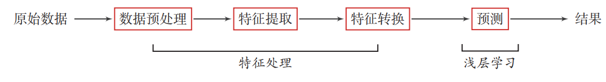

### 1.3 表示学习
  1. 表示学习：可以自动地学习出有效的特征，并提高最终机器学习模型的性能
     - 表示学习的关键是解决`语义鸿沟`问题。`语义鸿沟`问题是指输入数据的底层特征与高层语义信息之间的不一致性和差异性。
  2. 一个好的表示(特征)具有以下优点：
  - 一个好的表示应该具有很强的表示能力，即同样大小的向量可以表示更多信息
  - 一个好的表示应该使后续的学习任务变得简单，即需要包含更高层的语义信息
  - 一个好的表示应该具有一般性，是任务或领域独立的
  3. 表示特征的两种方式：`局部表示`和`分布式表示`
  4. `嵌入`：通常指将一个度量空间中的一些对象映射到另一个低维的度量空间中，并尽可能保持不同对象之间的拓扑关系

### 1.4 深度学习
   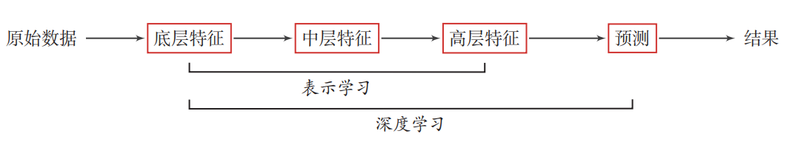
   1. `端到端学习`，也称`端到端训练`,是指在学习过程中不进行分模块或分阶段训练，直接优化任务的总体目标

## 第二章 机器学习概述

### 2.1 基本概念
  1. 数据集：一组样本构成的集合
     - 训练集中的样本是用来训练模型的
     - 测试集中的样本是用来检测模型好坏的
  2. `特征向量`：一个D维向量表示一个样本的所有特征构成的向量
  3. 机器学习系统示例：
     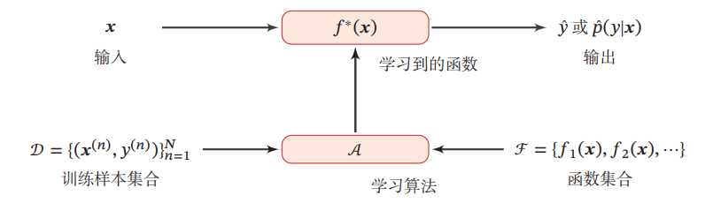

### 2.2 机器学习的三个基本要素
  1. 模型
     - 线性模型
     $$f(x;\theta) = w^Tx + b$$
     - 非线性模型
     $$f(x;\theta) = w^T{\phi(x)} + b$$
     其中，$\phi(x)=[\phi_1(x), \phi_2(x),...,\phi_K(x)]$为$K$个非线性基函数组成的向量
  2. 学习准则
  - 损失函数是一个非实数函数，用来量化模型预测和真实标签之间的差异
    - `0-1损失函数`：虽然能够客观评价模型的好坏，但其缺点是数学性质不是很好：不连续且导数为0，难以优化
    -  `平方损失函数`：经常用在预测标签y为实数的值的任务中；平方损失函数一般不适用于分类问题
    -  `交叉熵损失函数`：一般用于分类问题
    -  `Hinge损失函数`
  - 风险最小化准则：用来控制模型的学习率，使得损失函数最小化
    - 训练集上的平均损失：
      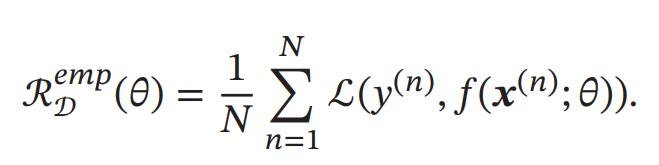
    - `过拟合`:模型在训练集上错误率很低，但是在未知数据上错误率很高
      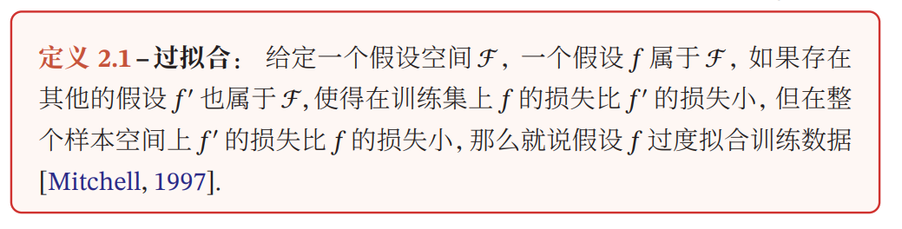
      过拟合问题往往是由于**训练数据少**和**噪声**以及**模型能力强**等原因造成的。
      >为了解决过拟合问题，一般在经验风险最小化的基础上再引入参数的`正则化`来限制模型能力，使其不要过度的最小化经验风险

    - `欠拟合`:模型不能很好地拟合训练数据，在训练集上错误率很高
      欠拟合一般是由**模型能力不足**造成的。
    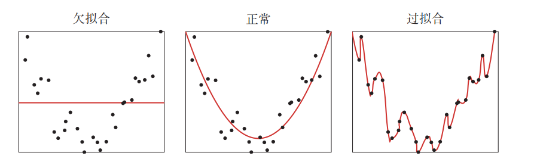  
  3. 优化算法
  - **参数与超参数**
    - 模型$f(x;\theta)$中的$\theta$称为模型的参数，可以通过优化算法进行学习
    - `超参数`:用来定义模型结构或优化策略。常见的超参数包括：聚类算法中的类别个数、梯度下降法中的步长、正则化项的系数、神经网络的层数、支持向量机中的核函数等。
  - 梯度下降法
    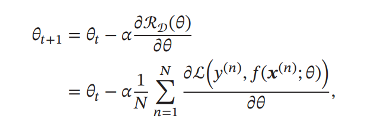
  - 提前停止
    - 针对梯度下降的优化算法，除了加正则化项之外，还可以通过**提前停止**来防止过拟合
    - 在梯度下降训练的过程中，由于过拟合的原因，在训练样本上收敛的参数，并不一定在测试集上最优。因此，除了训练集和测试集之外，有时还会使用一个`验证集(开发集)`来进行模型选择，测试模型是否在验证集上最优。
    - `提前停止`：如果模型在验证集上的错误率不再下降，就停止迭代.  
    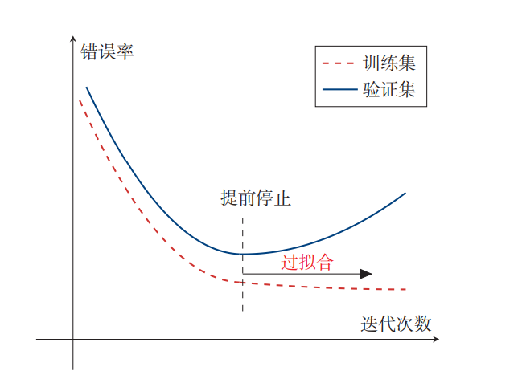
  - 随机梯度下降法
    - 批量梯度下降法在每次迭代时需要计算每个样本损失函数的梯度并求和。当训练集中的样本量N很大时，空间复杂度较高，每次迭代的计算开销也很大。
    - `随机梯度下降法`：为了减少每次迭代的计算复杂度，在每次迭代时只采集一个样本，计算这个样本损失函数的梯度并更新参数
    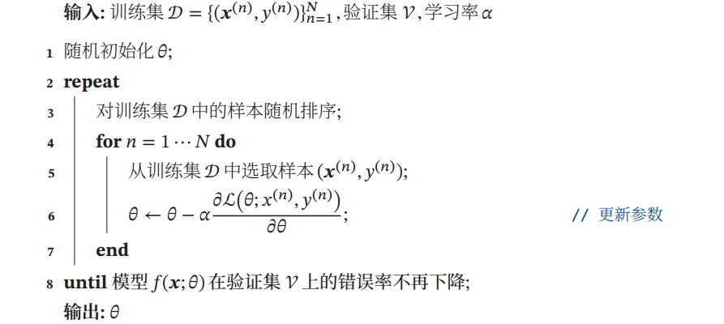
    > 批量梯度下降与随机梯度下降之间的区别在于，每次迭代的优化目标是对所有样本的平均损失函数还是对单个样本的损失函数。   
      随机梯度下降相当于在批量梯度下降的梯度上引入了随机噪声。在非凸优化问题中，随机梯度下降更容易逃离局部最优点。

     随机梯度下降法的一个缺点是无法充分利用计算机的并行计算能力
  - 小批量梯度下降法
    - 小批量梯度下降法是批量梯度下降和随机梯度下降的折中，每次迭代时，随机选取一小部分训练样本来计算梯度并更新参数。
    - 第$t$次迭代时，随机选取一个包含$K$个样本的子集$S_t$，计算这个子集上每个样本损失函数的梯度并进行平均，然后再进行参数更新。
  
    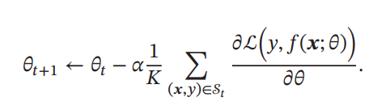
    > 在实际应用中，小批量随机梯度下降法有收敛快、计算开销小的优点，因此逐渐成为大规模的机器学习中的主要优化算法。

### 2.3 机器学习的简单示例————线性回归
  `线性回归`是一种对自变量和因变量之间关系进行建模的回归分析。自变量数量为1时称为`简单回归`，自变量数量大于1时称为`多元回归`。
  - 自变量为样本的特征向量$X\in \Bbb R^D$(每一维对应一个自变量)，因变量是标签$y$。   
    假设空间是一组参数化的线性函数：
    $$f(x;w;b)=w^Tx+b$$  
    其中权重向量$w\in \Bbb R^D$和偏置$b\inR $都是可学习的参数，函数$f(x;w;b)\inR$也称为`线性模型`
  - 参数估计方法：
    1. 经验风险最小
    2. 结构风险最小化
    3. 最大似然估计
    4. 最大后验估计  

### 2.4 偏差-方差分解
   - 拟合能力强的模型一般复杂度会比较高，容易导致过拟合；相反，如果限制模型的复杂度，降低其拟合能力，又可能会导致欠拟合。
   - `偏差`：指一个模型在不同训练集上的平均性能和最优模型的差异，可以用来衡量一个模型的拟合能力
   - `方差`：指一个模型在不同训练集上的差异，可以用来衡量一个模型是否容易过拟合。方差一般会随着训练样本的增加而减少。
     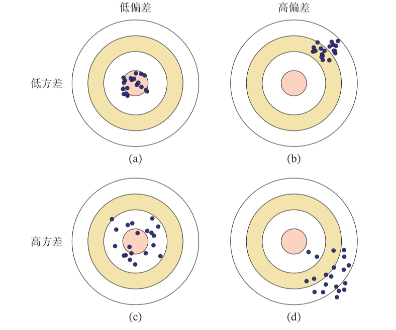
   - 随着模型复杂度的增加，模型的拟合能力变强，偏差减小而方差增大，从而导致过拟合。
     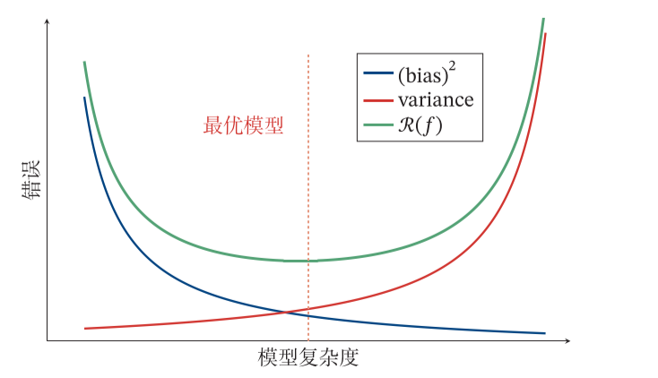
   - 一般来说，当一个模型在训练集上的错误率比较高时，说明模型的拟合能力不够，偏差比较高。这种情况可以通过增加数据特征、提高模型复杂度、减小正则化系数等操作来改进。当模型在训练集上的错误率比较低，但验证集上的错误率比较高，说明模型过拟合，方差比较高，这种情况可以通过降低模型复杂度、加大正则化系数、引入先验等方法来缓解。
   - 一种有效降低方差的方法为`集成模型`，即通过引入多个高方差模型的平均来降低方差。

### 2.5 机器学习算法的类型
  - 按函数$f(x;\theta)$的不同，机器学习算法可以分为线性模型和非线性模型。
  - 按学习准则的不同，机器学习算法可以分为统计方法和非统计方法。
  - 按训练样本提供的信息以及反馈方式的不同，机器学习算法可以分为以下几类：
    1. `监督学习`:目标是建模样本的特征x和标签y之间的关系，并且训练集中每个样本都有标签。
       - 回归问题：标签y为连续值（实数或连续整数）
       - 分类问题：标签y是离散的类别（符号）
       - 结构化学习：是一种特殊的分类问题。在结构化学习中，标签y通常是结构化的对象，比如序列、树或图等
    2. `无监督学习`：是指从不包含目标标签的训练样本中自动学习到一些有价值的东西。典型的无监督学习问题有聚类、密度估计、特征学习、降维等。
    3. `强化学习`：是一类通过交互来学习的机器学习算法。  
    

### 2.6 数据的特征表示
   1. 传统的特征学习
      - `特征选择`：选取原始特征集合的一个有效子集，使得基于这个特征子集训练出来的模型准确率最高。简单地说，特征选择就是保留有用特征，移除冗余或无关的特征。
        1. **子集搜索**
        - `前向搜索`：由空集合开始，每一轮添加该轮最优的特征   
        - `反向搜索`：从原始特征集合开始，每次删除最无用的特征
        - 子集搜索方法可以分为`过滤式方法`和`包裹式方法`。
          > `过滤式方法`是不依赖具体机器学习模型的特征选择方法。每次增加最有信息量的特征，或删除最没有信息量的特征。特征额信息量可以通过`信息增益`来衡量。   
          > `包裹式方法`是使用后续机器学习模型的准确率作为评价来选择一个特征子集的方法。每次增加对后续学习机器模型最有用的特征，或删除对后续学习机器任务最无用的特征。
        1. **正则化**
      - `特征抽取`：是构造一个新的特征空间，并将原始特征投影在新的空间中得到新的表示。以线性投影为例，令$x\in \Bbb R^D$为原始特征向量，$x' \in R^K$为经过线性投影后得到的在新空间中的特征向量，有
      $$x' = Wx$$ 
      其中$W \in R^{K \times D}$为映射矩阵。
      - 传统的特征选择和特征抽取方法
      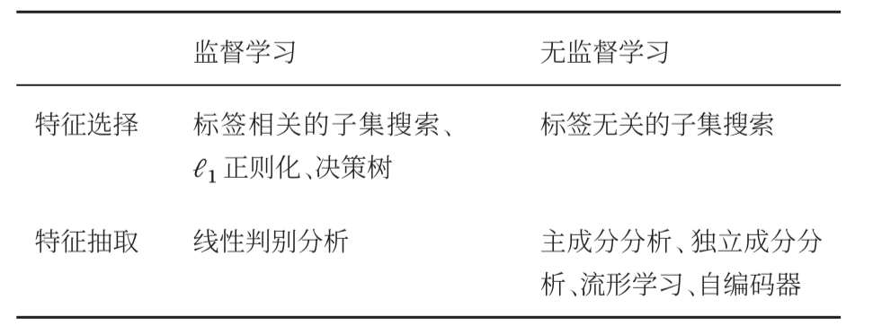
      - 经过特征选择或特征抽取后，特征的数量一般会减少，因此特征选择和特征抽取也经常称为`维数约减`或`降维`。
   2. 深度学习方法
      - `深度学习`：将特征的表示学习和机器学习的预测学习有机地统一到一个模型中，建立一个端到端地学习算法，可以有效地避免他们之间准则地不一致性。

### 2.7 评价指标
  - 为了衡量一个机器学习模型地好坏，需要给定一个测试集，用模型对测试集中的每一个样本进行预测，并根据预测结果计算评价分数。
  1. `准确率(Accuracy)`：对于分类问题，准确率是指预测正确的样本占总样本的比例。对于回归问题，准确率是指预测正确的样本的均方误差。
      
  2. `错误率(Error Rate)`：对于分类问题，错误率是指预测错误的样本占总样本的比例。对于回归问题，错误率是指预测错误的样本的均方误差。
   
