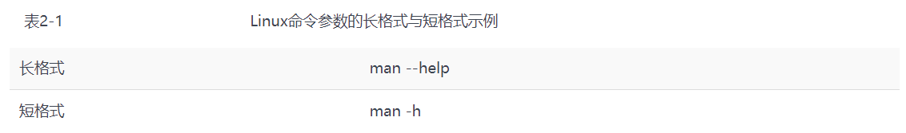
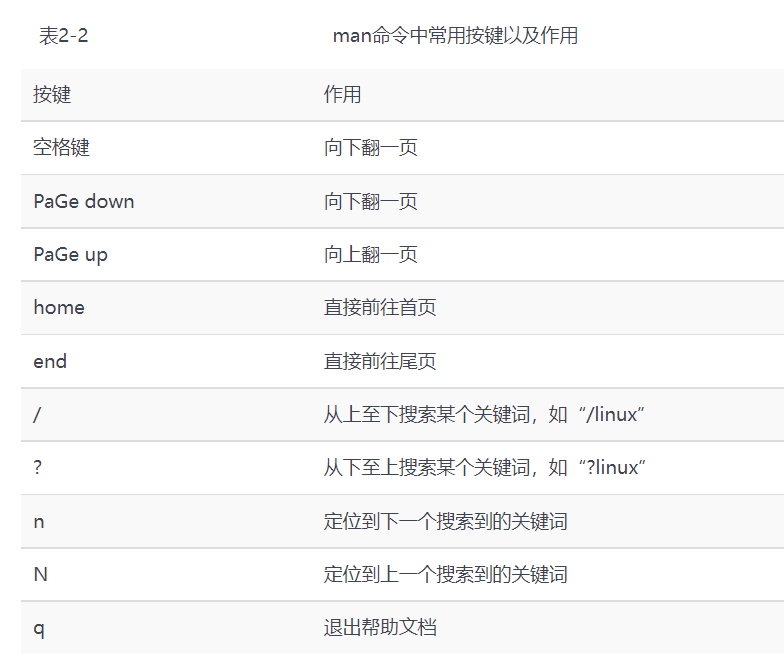
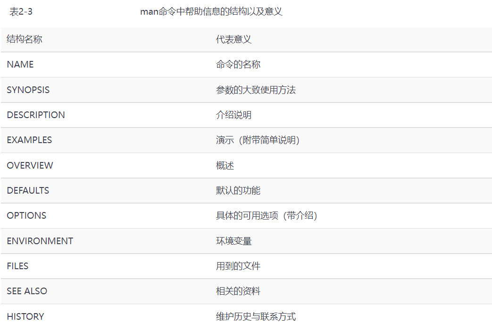

# 前言

1. 开源许可证

   ​	

2. 开源软件4大关键性优势：

   - 低风险
   - 高品质
   - 低成本
   - 更透明

3. **Linux系统内核**指的是一个由Linus Torvalds负责维护，提供硬件抽象层、磁盘、文件系统控制及多任务功能的系统核心程序

4. **Linux发行套件系统**是我们常说的Linux操作系统，也就是由Linux内核与各种常用软件的集合产品。

5. 常见的Linux系统版本

   - 红帽企业版Linux（**RHEL**）
   - 社区企业操作系统（**CentOS**），CentOS系统和RHEL系统的软件包可以通用
   - **Fedora**
   - **Debian**
   - **Ubuntu**
   - **openSUSE**
   - **Kali**
   - **Gentoo**
   - 深度操作系统（**Deepin**）

##  动手部署一台Linux操作系统

 bios界面启动vm

## 新手必须掌握的Linux命令

  常见的执行Linux命令格式是下面这样的

> **命令名称   [命令参数]   [命令对象]**

- **命令名称**：就是语法中的"动词"

- **命令参数**：用于对命令进行调整，让“修改”过的命令能更好的贴合工作需求。参数可以使用长格式(完整的选项名称)，也可以用短格式(单个字符缩写)，两者分别用`--`与`-`作为前缀

  

- **命令对象**：一般指要处理的文件、目录、用户等资源名称

  **注意**：

  - 命令名称、命令参数、命令对象之间要用空格进行分隔，且字母严格区分大小写

- man命令中常用按键及作用

​       

- man命令中帮助信息的结构以及意义

  

