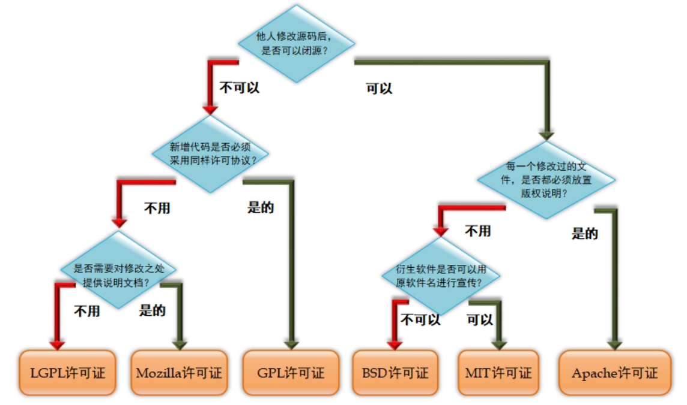

# 前言

1. 开源许可证

   ​	

2. 开源软件4大关键性优势：

   - 低风险
   - 高品质
   - 低成本
   - 更透明

3. **Linux系统内核**指的是一个由Linus Torvalds负责维护，提供硬件抽象层、磁盘、文件系统控制及多任务功能的系统核心程序

4. **Linux发行套件系统**是我们常说的Linux操作系统，也就是由Linux内核与各种常用软件的集合产品。

5. 常见的Linux系统版本

   - 红帽企业版Linux（**RHEL**）
   - 社区企业操作系统（**CentOS**），CentOS系统和RHEL系统的软件包可以通用
   - **Fedora**
   - **Debian**
   - **Ubuntu**
   - **openSUSE**
   - **Kali**
   - **Gentoo**
   - 深度操作系统（**Deepin**）

# 第一章 动手部署一台Linux操作系统

 